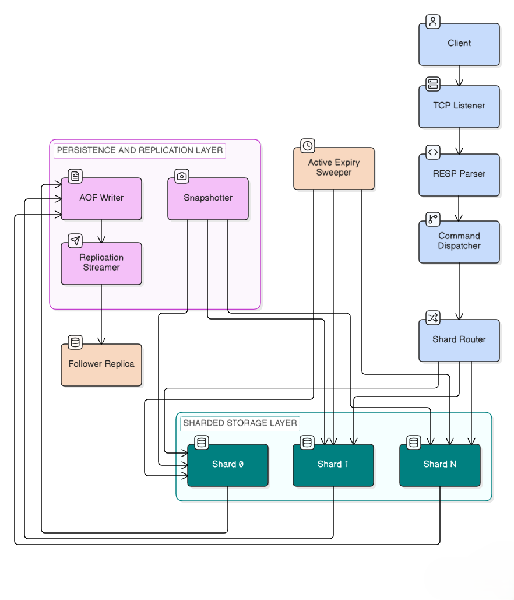

# MiniCache

[](https://github.com/Git-Kapish/MiniCache/actions/workflows/ci.yml/badge.svg)

**A Low-Level Design (LLD) project** — a Redis-like, distributed in-memory key-value cache built from scratch in C++17. Implements a real wire protocol (RESP2, compatible with `redis-cli`), sharded concurrent storage, pluggable eviction policies, crash-recoverable persistence, consistent hashing, and leader-follower replication.

This project demonstrates core low-level system design principles: data structure selection under concurrency and memory constraints, design pattern usage (Strategy, Command, Factory, Observer), and the durability/performance tradeoffs behind a production-grade in-memory datastore.

Full technical documentation:

- [`PRD.md`](./PRD.md) — Product requirements, scope, and non-goals
- [`ARCHITECTURE.md`](./ARCHITECTURE.md) — Component layout, memory model, concurrency, and design patterns
- [`AGENTS.md`](./AGENTS.md) — Module boundaries, build commands, and coding conventions
- [`TECH_STACK.md`](./TECH_STACK.md) — Language and tooling choices with technical rationale

---

## Implementation Phases

All phases below — including both stretch goals — are complete.

### Phase 1 — Core single-threaded store 
Single-shard in-memory store, lazy TTL expiry, RESP2 parser/encoder, TCP listener with thread-per-connection handling, and the core string/counter command set (`SET`, `GET`, `DEL`, `EXISTS`, `EXPIRE`, `TTL`, `PERSIST`, `INCR`, `DECR`).

### Phase 2 — Concurrency, sharding, eviction 
`ShardRouter` partitioning the keyspace across N shards, per-shard locking to bound contention, `EvictionPolicy` (Strategy pattern) with `LRUPolicy` and `LFUPolicy`, an active expiry sweeper, and the remaining Hash/List/Set command sets.

### Phase 3 — Persistence & benchmarking 
Per-shard AOF with configurable fsync policy, periodic snapshotting, startup recovery (snapshot + AOF replay), and real throughput/latency numbers captured via `redis-benchmark` (see below).

### Phase 4 — Stretch goals 
Originally scoped as "if time remains" — both shipped:
- **Consistent hashing** (`ConsistentHashRing`, FNV-1a, 100 virtual nodes/shard) replacing plain `hash(key) % N`, minimizing key relocation on ring resize.
- **Leader-follower replication** — a leader streams committed writes to read-only followers over a persistent connection (`--replicaof`).

---

## Project Architecture & Directory Layout

```
minicache/
├── PRD.md
├── ARCHITECTURE.md
├── AGENTS.md
├── TECH_STACK.md
├── README.md
├── CMakeLists.txt
├── .gitignore
├── src/
│   ├── net/              # TCP listener & socket abstraction (thread-per-connection)
│   ├── protocol/          # RESP2 parser and encoder (bytes <-> RespArray/RespValue)
│   ├── command/            # Command objects, CommandFactory, Dispatcher
│   ├── store/               # Shard, Entry, ShardRouter, ConsistentHashRing, TTL sweeper
│   ├── eviction/             # Strategy pattern: LRUPolicy, LFUPolicy, NoEvictionPolicy
│   ├── persistence/           # AOF Writer, Snapshotter, Startup Recovery Engine
│   ├── replication/            # Leader streamer & Follower replication client
│   └── main.cpp                 # Main entry point & CLI configuration parsing
└── tests/
    ├── test_resp_protocol.cpp
    ├── test_shard.cpp
    ├── test_eviction.cpp
    ├── test_concurrency_stress.cpp
    ├── test_persistence.cpp
    ├── test_consistent_hash.cpp
    └── test_replication.cpp
```

---

## Architecture Diagram



Request flow (blue): `redis-cli` client → TCP listener → RESP parser/encoder → command dispatcher → shard router. The shard router fans out to the sharded storage layer (teal), where each shard owns its own hashmap, mutex, and eviction policy. Writes flow from each shard into the persistence & replication layer (purple) — AOF writer, snapshotter, and replication streamer — which pushes committed writes to read-only follower replicas and periodic snapshots (amber components run as background threads touching all shards: the active expiry sweeper and follower replica).

---

## Low-Level Design (LLD) Patterns

| Design Pattern | Implementation | Purpose & Tradeoff |
|---|---|---|
| **Strategy Pattern** | `EvictionPolicy` (`LRUPolicy`, `LFUPolicy`, `NoEvictionPolicy`) | Swaps memory eviction algorithms dynamically without modifying shard storage logic. |
| **Command Pattern** | `Command` hierarchy (`SetCommand`, `GetCommand`, `HSetCommand`, etc.) | Encapsulates parsed request execution; identical objects are reused for AOF logging and replication broadcasting. |
| **Factory Pattern** | `CommandFactory` | Decouples RESP array parsing from command construction and validates arguments centrally. |
| **Observer Pattern** | `ReplicationStreamer` | Leader streams committed RESP write events to followers asynchronously without coupling the hot write execution path. |
| **Consistent Hashing** | `ConsistentHashRing` | Ring placement using FNV-1a hashing and 100 virtual nodes/shard to minimize key relocation during ring scaling. |

---

## Command Reference

| Type | Commands |
|---|---|
| String | `SET`, `GET`, `DEL`, `EXISTS`, `INCR`, `DECR`, `APPEND`, `STRLEN` |
| Expiry | `EXPIRE key seconds`, `TTL key`, `PERSIST key` |
| Hash | `HSET`, `HGET`, `HDEL`, `HGETALL`, `HEXISTS` |
| List | `LPUSH`, `RPUSH`, `LPOP`, `RPOP`, `LRANGE`, `LLEN` |
| Set | `SADD`, `SREM`, `SISMEMBER`, `SMEMBERS` |
| Server | `PING`, `INFO`, `DBSIZE`, `FLUSHALL`, `SHUTDOWN` |

---

## Server Configuration Options

| Option | Flag | Default | Description |
|---|---|---|---|
| Port | `--port`, `-p` | `6380` | TCP port to listen on. |
| Shards | `--shards` | `4` | Number of independent internal storage shards. |
| Memory Limit | `--maxmemory` | `256mb` | Total memory limit across all shards (e.g. `256mb`, `1gb`). |
| Eviction Policy | `--eviction` | `lru` | Eviction strategy: `lru`, `lfu`, or `noeviction`. |
| Sharding Mode | `--sharding-mode` | `modulo` | Key partitioning strategy: `modulo` or `consistent`. |
| AOF Persistence | `--aof` | `true` | Enable append-only write logging: `true` or `false`. |
| AOF File Path | `--aof-file` | `appendonly.aof` | Path to the AOF log file. |
| Fsync Policy | `--fsync` | `everysec` | Disk sync policy: `everysec`, `always`, or `never`. |
| Replication Mode | `--replicaof` | *(none)* | Run as Follower replica streaming from `<host> <port>` (Read-Only mode). |

---

## Benchmark Results

*(Measured using `redis-benchmark -p 6380 -t set,get -n 100000 -c 50` against live MiniCache server running 4 shards with AOF persistence enabled)*

```
SET: 9,711.57 requests per second (p50: 6.0 ms, p99: 18.0 ms)
GET: 11,516.76 requests per second (p50: 3.0 ms, p99: 7.0 ms)
```

---

## Known Gaps (explicitly out of scope, not oversights)

- No pub/sub, Lua scripting, cluster mode, or multi-key transactions (`MULTI`/`EXEC`).
- Replication has no automatic failover or consensus protocol — a follower promoted manually would not reconcile any divergent writes.
- No backpressure/catch-up protocol if a follower falls behind the leader's stream.

Full list and rationale in `PRD.md` §3.

## What I'd Do at Scale

- Replace thread-per-connection with an epoll/kqueue event loop; replace per-shard mutexes with a single-threaded event loop per shard (actor-style, matching real Redis's model), removing locking from the hot path entirely.
- Batch/group-commit AOF fsyncs instead of per-write, to raise write throughput under the `everysec` policy.
- Add a sequencer stage ahead of replication to guarantee a single global write order across a cluster, plus quorum-based failover instead of the current unprotected leader-follower setup.

---

## Getting Started & Building

### 1. Build and Run Tests

#### Windows (MSVC):
```
mkdir -p build && cd build
& "C:\Program Files (x86)\Microsoft Visual Studio\18\BuildTools\Common7\IDE\CommonExtensions\Microsoft\CMake\CMake\bin\cmake.exe" .. -DCMAKE_BUILD_TYPE=Debug
& "C:\Program Files (x86)\Microsoft Visual Studio\18\BuildTools\Common7\IDE\CommonExtensions\Microsoft\CMake\CMake\bin\cmake.exe" --build . --config Debug

# Run full CTest suite (7/7 test targets)
& "C:\Program Files (x86)\Microsoft Visual Studio\18\BuildTools\Common7\IDE\CommonExtensions\Microsoft\CMake\CMake\bin\ctest.exe" --output-on-failure -C Debug
```

#### Linux / macOS:
```
mkdir -p build && cd build
cmake .. -DCMAKE_BUILD_TYPE=Release
make -j$(nproc)

# Run full CTest suite
ctest --output-on-failure
```

### 2. Running MiniCache

#### Single Server Mode:
```
./Debug/minicache_server.exe --port 6380 --shards 4 --maxmemory 256mb --eviction lru --aof true
```

#### Leader-Follower Replication Mode:
```
# Terminal 1 (Leader):
./Debug/minicache_server.exe --port 6380

# Terminal 2 (Follower - Read Only):
./Debug/minicache_server.exe --port 6381 --replicaof 127.0.0.1 6380
```

#### Client Interaction (`redis-cli`):
```
redis-cli -p 6380 SET foo "bar"
redis-cli -p 6380 GET foo
redis-cli -p 6380 HSET user:1 name "Alice" email "alice@test.com"
redis-cli -p 6380 HGETALL user:1
```
